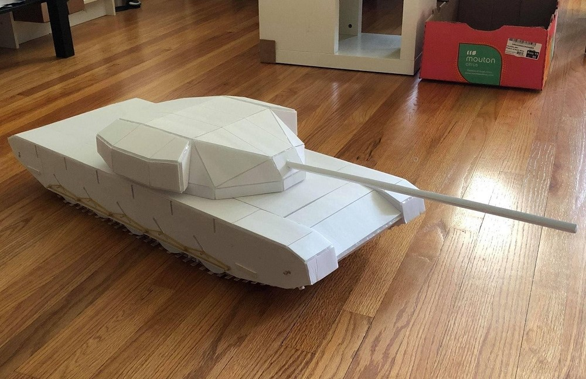
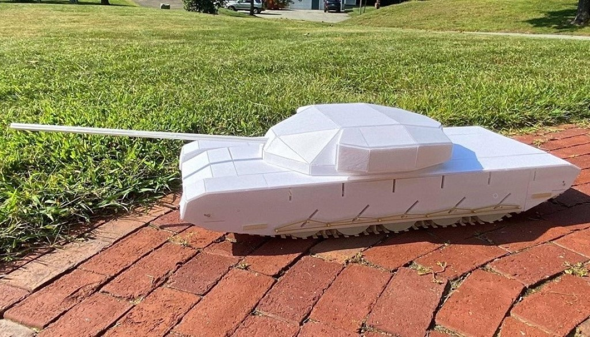
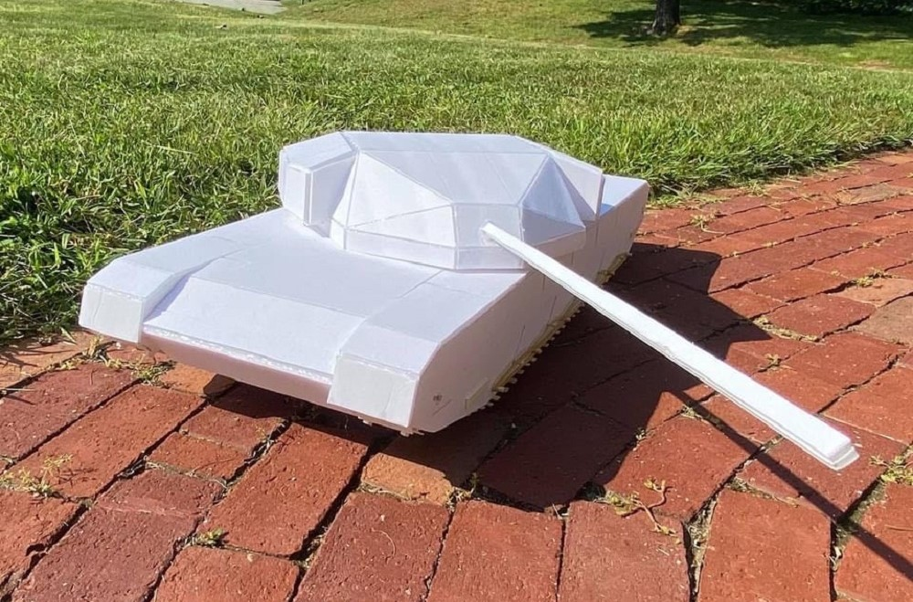
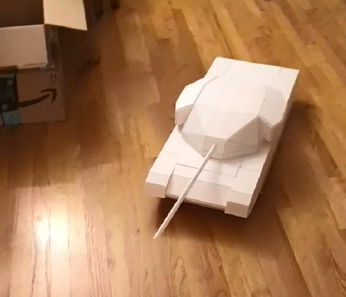
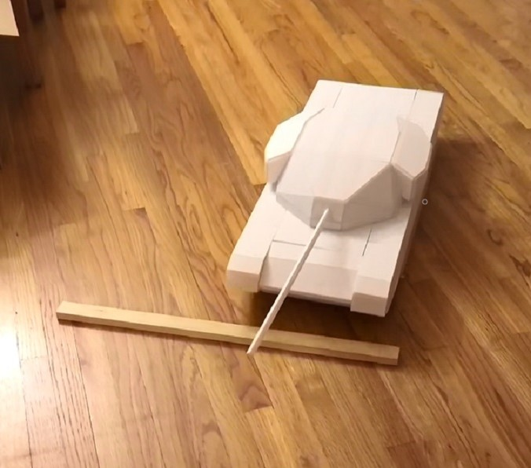
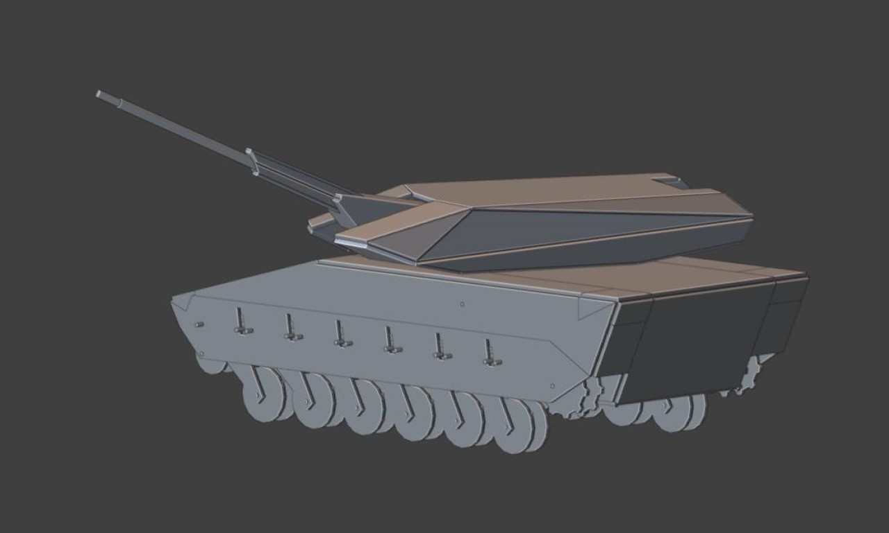
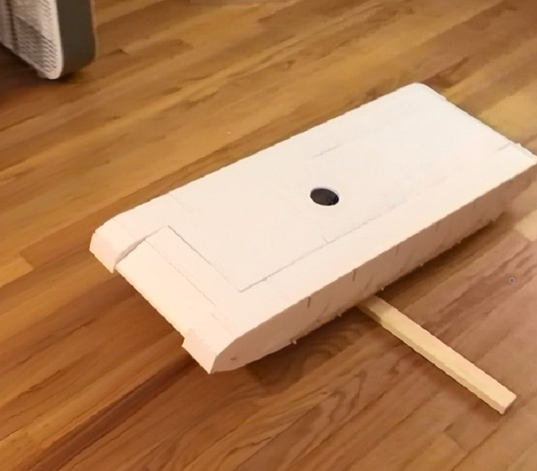

# Tank Models

During 10th grade, I was in love with the strategic tank combat game **World of Tanks Blitz** and wanted to try making some tanks models for myself to play with in the real world.

## FV4202

In World of Tanks Blitz, tanks were categorized by Nation and the one I played was Great Britain. The most advanced tank in the British tech tree was the [FV4202](https://www.google.com/search?sca_esv=574320914&rlz=1C1ONGR_enUS1043US1043&sxsrf=AM9HkKm9PYcl9msLUvoJFeGoKd0TwWAUEQ:1697596318146&q=fv4202&tbm=isch&source=lnms&sa=X&sqi=2&ved=2ahUKEwi0hI-Mx_6BAxVSEVkFHcpNCEAQ0pQJegQIDhAB&biw=1920&bih=963&dpr=1), so I decided to model my second model tank after it.

| | | ||
|-|-|-|-|

### Video Demonstrations

Here are some short videos of me driving the tank over some small obstacles indoors and driving them around outdoors.
|||||
|-|-|-|-|

## KF41 Lynx Infantry Fighting Vehicle

After building the model FV4202, I wanted to improve my models even further by adding even more features such as a rotating turret, pivoting barrel, and a gear box. Because I still didn't have access to 3D printing at this point, all the gears were designed to be made with foam and popsicle sticks and were extremely difficult to assmble. Due to these complications and time limitations of summer ending, this model was never fully constructed.

| | | |
|-|-|-|
| | | |

## First Prototype

At this time, I was first learning about the world of Arduino and its accompanying suite of sensors and actuators. I decided to try them out in this project and incorporate small DC motors and radio control modules to power and control the tanks.

| | | |
|-|-|-|
| | | |

Since I was a child, I've always been fascinated by complex mechanisms. Designing and testing these different types of sliding and pivoting suspension systems was really a dream come true for me. It also taught me that even though things might seem difficult and unapproachable at first, I should never let that stop me from trying.

Here are a few clips of the different models driving over obstacles. 
||||
|-|-|-|