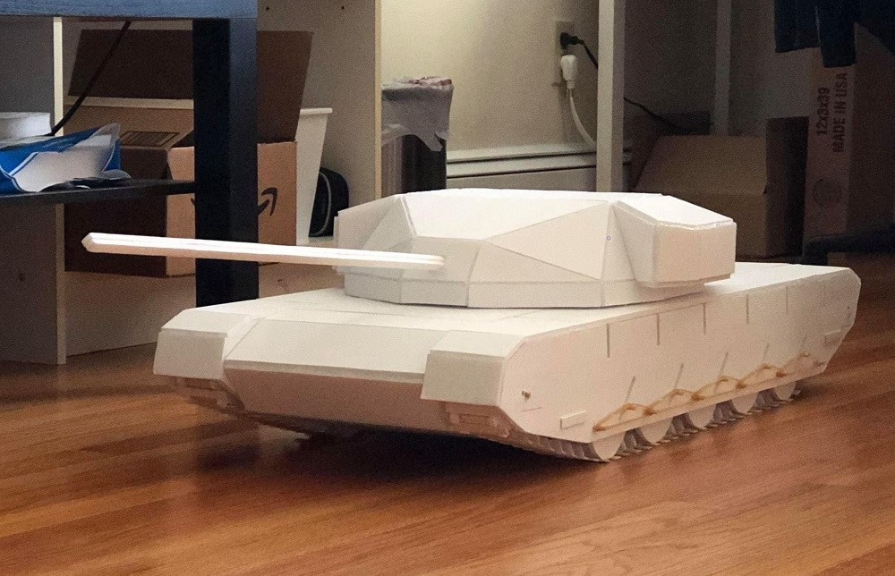
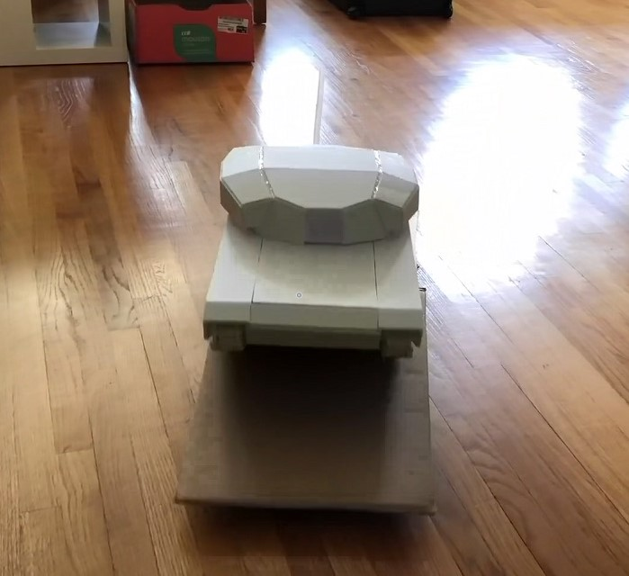
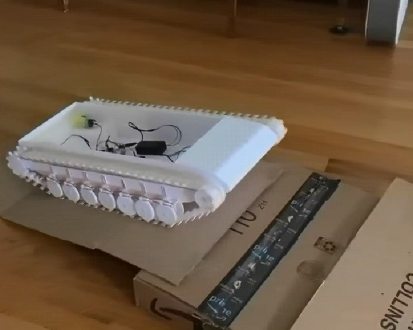
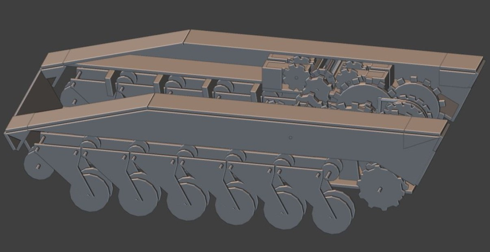

# Tank Models

I am stinky stinky Bruce and I like to build model. hehe

## My Tank Pictures
| | | ||
|-|-|-|-|

## My Tank with remote control in action

Summer is too short. I can only implement the remote control system for my tank (arduino with radio module), but have no time to implement the power system for tank turret. Click image to see video clips
|||||
|-|-|-|-|

## My track system with remote control in action

These two suspension systems work equally well. I use the latest one (the right video) to build my final tank model with turret. Click image to see video clips.
||||
|-|-|-|

## My tank desgin in Blender
| | | |
|-|-|-|
| | | |

## My track system without remote control  in action

Click image to see video clips
||||
|-|-|-|

## My track design and remote controller

I have designed many different models with differernt suspension systems in order to cross obstacles. First few designs do not work very well. The last two more complicated design seem function pretty good. 

| | | |
|-|-|-|
| | | |

